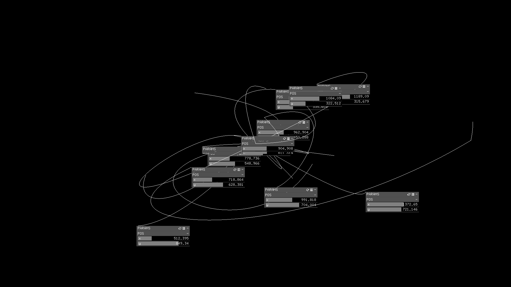

# Entanglement

[Demo](https://i.imgur.com/QmXN4z9.mp4)

> Quantum entanglement is a quantum mechanical phenomenon in which the quantum states of two or more objects have to be described with reference to each other, even though the individual objects may be spatially separated.

When I initially started working on this piece, I was hoping to make a generative work based on `ofxGui` elements rather than the usual 2D/3D shapes and lines. In my mind, I had vaguely envisioned panels and sliders moving around in visually appealing ways, so I began experimenting with having sliders that reacted to the panels' movements (e.g. displaying coordinates).

When debugging some particularly problematic issues with curved panel movements, I implemented a path-drawing function to see the movement paths in greater detail. However, I ended up liking the way the drawn paths looked so much that I pivoted off of the GUI idea and instead pursued this new avenue of "elegant" movement. However, I have left in the GUI movements as an extra feature toggleable via spacebar.



## Properties

### Colors

I tried playing around with different colors, but eventually settled on keeping things minimalist/simple. I didn't like the way that colors really looked in relation to my piece, but pressing spacebar will give you colors.

### R/evolution

The lines each move in constrained randomness; that is, each line's general positioning/curvature is random but follow the restrictions of a Bezier curve. The speed at which each curve is drawn is also random. To provide a final aesthetic touch, I made it probable for lines to return to the center of the screen, creating a general sense of source/target and biasing the image towards looping shapes.

## Build

Requires OpenFrameworks.

```
make && make run
```
